<h1 align="center">Hi, I'm Mubashra Iftikhar</h1>

<!-- Dynamic Dark/Light Banner -->
<picture>
  <source media="(prefers-color-scheme: dark)" srcset="assets/profile-banner-dark.svg">
  <source media="(prefers-color-scheme: light)" srcset="assets/profile-banner-light.svg">
  
</picture>

### 📊 GitHub Stats

  
  

### 📬 Let's Connect

